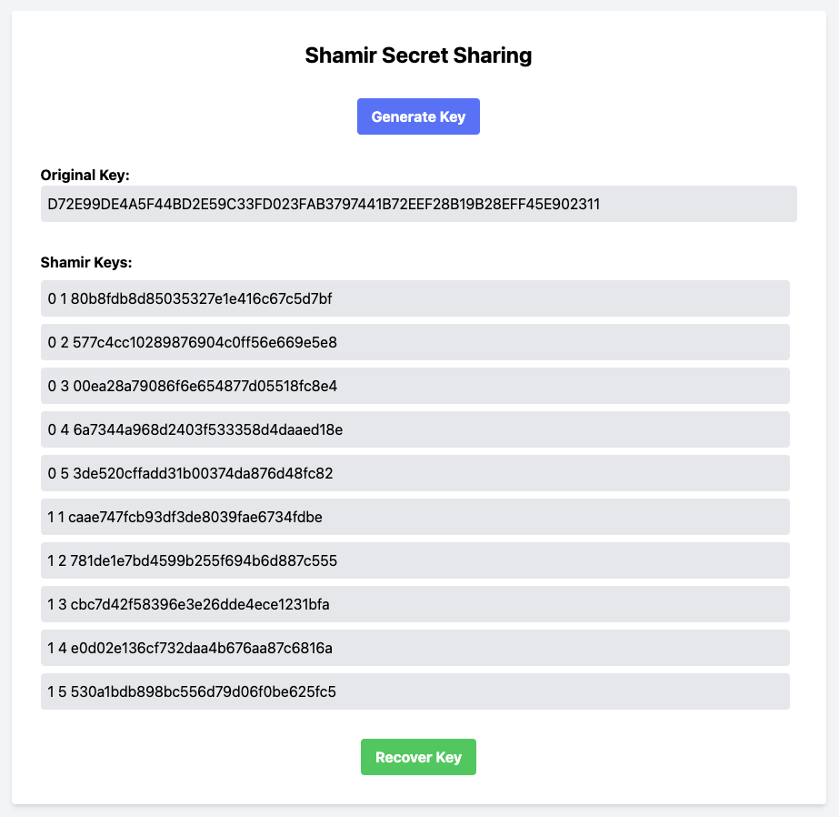
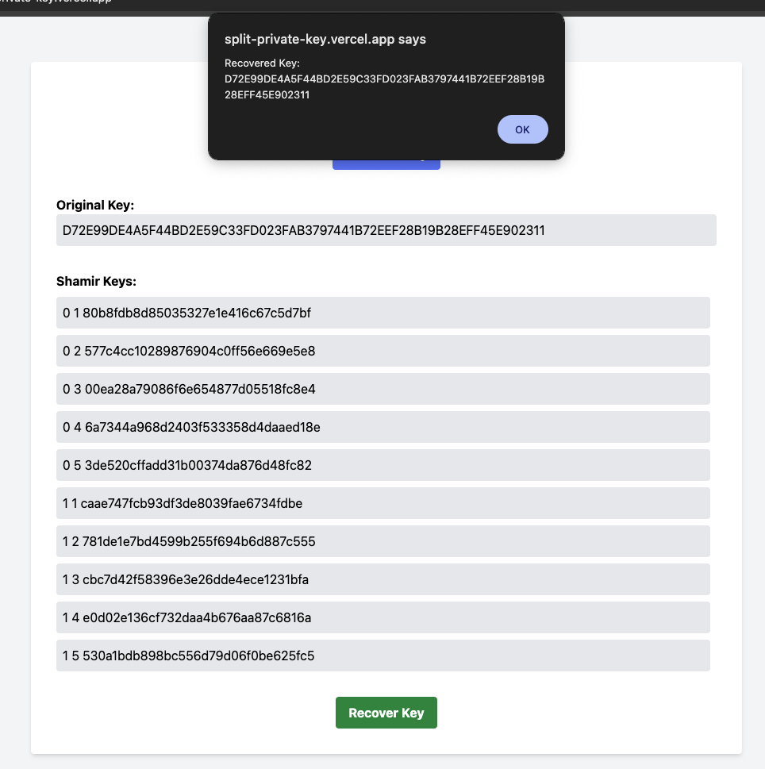
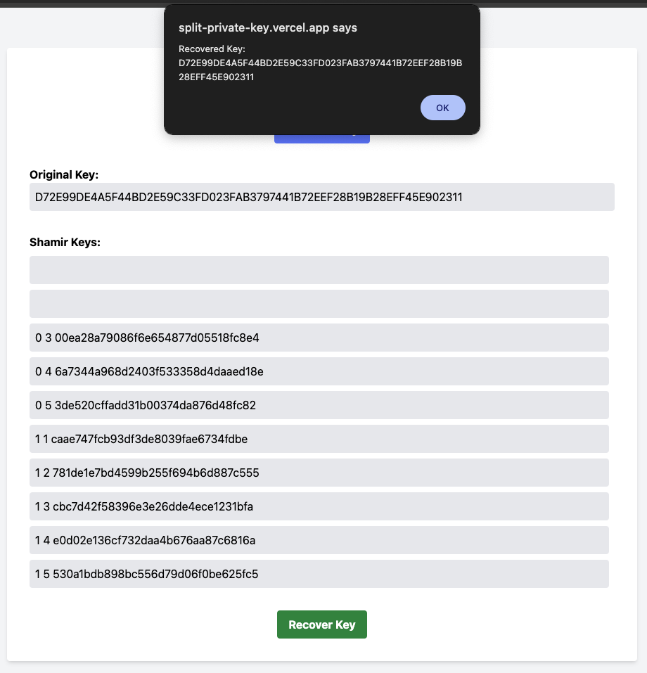
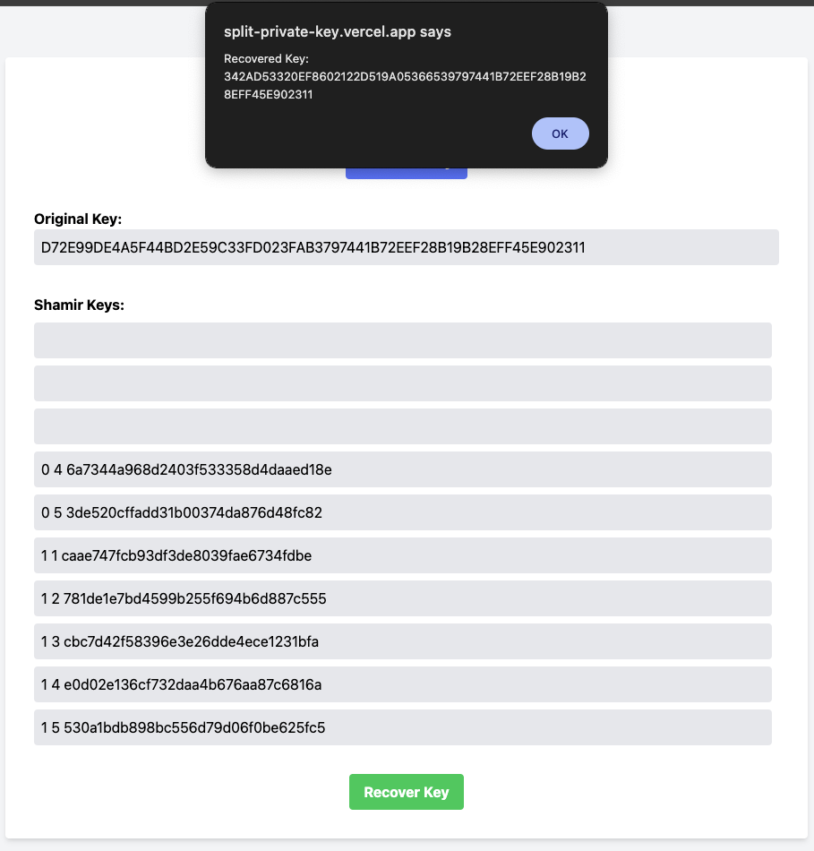

# Shamir for ed25519

This is a simple implementation of Shamir's Secret Sharing Scheme for Symbol PrivateKeys.

## Demo

https://split-private-key.vercel.app/

## Usage

setup the environment and run the script

```bash
python -m venv .venv
source .venv/bin/activate
pip install -r requirements.txt
```

start the script

```bash
sh entrypoint.sh
```

## Example

This API server can split an ed25519 private key using Shamir’s Secret Sharing. The ed25519 private key is 32 bytes of binary data. According to the specifications, after splitting the key into two parts, five shares are generated for each part.

By collecting three or more of the created five shares, the original private key can be restored.

```bash
ed25519 private key: D72E99DE4A5F44BD2E59C33FD023FAB3797441B72EEF28B19B28EFF45E902311

↓

key 1: D72E99DE4A5F44BD2E59C33FD023FAB3
key 2: 797441B72EEF28B19B28EFF45E902311

↓

share 1: 
  tuple(0, xxxxxxxxxxxxxxxxxxxxxxxxxxx)
  tuple(1, xxxxxxxxxxxxxxxxxxxxxxxxxxx)
  tuple(2, xxxxxxxxxxxxxxxxxxxxxxxxxxx)
  tuple(3, xxxxxxxxxxxxxxxxxxxxxxxxxxx)
  tuple(4, xxxxxxxxxxxxxxxxxxxxxxxxxxx)
share 2: 
  tuple(0, xxxxxxxxxxxxxxxxxxxxxxxxxxx)
  tuple(1, xxxxxxxxxxxxxxxxxxxxxxxxxxx)
  tuple(2, xxxxxxxxxxxxxxxxxxxxxxxxxxx)
  tuple(3, xxxxxxxxxxxxxxxxxxxxxxxxxxx)
  tuple(4, xxxxxxxxxxxxxxxxxxxxxxxxxxx)
```

## Screenshots

1. Generate Shamir Key


2. Recover Shamir Key（Success）


3. Recover Shamir Key（Success）
一部のキーを紛失しても元の秘密鍵を復元することができます。


4. Recover Shamir Key（Failure）
3つのキーを持っていないと元の秘密鍵を復元することができません。


## Note

Sure, here is the explanation in English using a quadratic polynomial example $y = ax^2 + bx + c$:

### Basic Concept

Shamir's Secret Sharing method divides a secret (e.g., a password or a cryptographic key) into multiple "shares" such that the secret can only be reconstructed when a sufficient number of shares are combined.

### Step-by-Step Explanation

1. **Determine the Secret**:
   - Let's take a secret number, for example, 42.

2. **Create the Polynomial**:
   - Form a polynomial where the secret is the constant term. Use random coefficients for the other terms. For example, let’s use:
     $y = ax^2 + bx + c$
   - Suppose $a = 3$, $b = 5$, and the secret $c = 42$. The polynomial becomes:
     $y = 3x^2 + 5x + 42$

3. **Generate Shares**:
   - Evaluate the polynomial at different values of $x$. For instance:
     - When $x = 1$: $y = 3(1)^2 + 5(1) + 42 = 50$ → Share is (1, 50)
     - When $x = 2$: $y = 3(2)^2 + 5(2) + 42 = 68$ → Share is (2, 68)
     - When $x = 3$: $y = 3(3)^2 + 5(3) + 42 = 96$ → Share is (3, 96)
     - When $x = 4$: $y = 3(4)^2 + 5(4) + 42 = 134$ → Share is (4, 134)
     - When $x = 5$: $y = 3(5)^2 + 5(5) + 42 = 182$ → Share is (5, 182)

4. **Distribute Shares**:
   - Distribute these shares to different participants. For example, give the shares (1, 50), (2, 68), (3, 96), (4, 134), and (5, 182) to five people.

5. **Reconstruct the Secret**:
   - To reconstruct the secret, at least three shares are needed. Suppose we have shares (1, 50), (2, 68), and (3, 96).
   - Use these shares to reconstruct the original polynomial using the Lagrange interpolation formula:
     $L(x) = \sum_{i=1}^{3} y_i \prod_{j=1, j \ne i}^{3} \frac{x - x_j}{x_i - x_j}$
     - $L_1(x)$ corresponds to the term for $x = 1$
     - $L_2(x)$ corresponds to the term for $x = 2$
     - $L_3(x)$ corresponds to the term for $x = 3$

6. **Calculate Coefficients**:
   - Plug the share values into the Lagrange interpolation formula to determine the coefficients.
   - The result is the original polynomial $y = 3x^2 + 5x + 42$, and the secret $c = 42$ is recovered when $x = 0$.

### Why It Is Secure

- With fewer than 3 shares, it is impossible to reconstruct the polynomial and therefore the secret remains safe.
- With 3 or more shares, the polynomial can be reconstructed accurately, revealing the secret.

This ensures that the secret can only be known when a sufficient number of shares are combined, providing a robust security mechanism.

